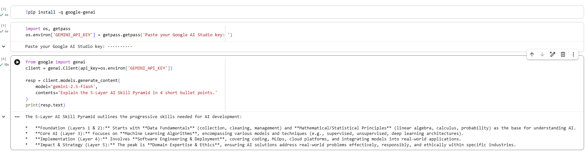
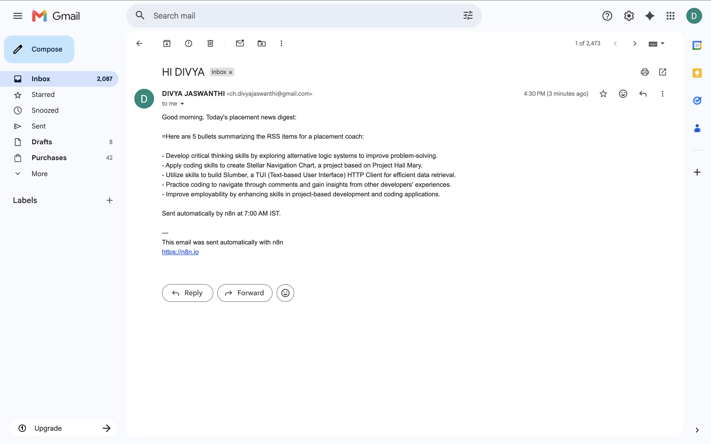

```markdown
# AI Mentor Bootcamp — Vegi Divya Jaswanthi

Public portfolio of 12-day AI Trainer Workshop. By Day 12: 6 daily notebooks + capstone Streamlit URL.
```

**Trainer note:** Write each mentor's repo URL on the whiteboard next to their name. By Day 12 you reference these URLs for grading.

**Acceptance:** `https://github.com/Vdivyajaswanthi123/ai-mentor-portfolio` is publicly accessible.
## Day 1 – Setup complete

- ✅ Google AI Studio API key provisioned
- ✅ Groq API key provisioned
- ✅ Hello-Gemini call working – see [Day1_Setup.ipynb](Day1_Setup.ipynb)

### Screenshot




## Day 4 — n8n Daily News Digest

- ✅ Self-hosted n8n via Docker
- ✅ Workflow: Schedule (7AM IST) → RSS → Gemini summariser → Gmail
- ✅ Workflow JSON committed: [Day4_NewsDigest.json](Day4_NewsDigest.json)
- ✅ Test email screenshot below



# Day 5 — Résumé Scorer Streamlit

**Live URL:** [https://your-app-name.streamlit.app ](https://resume-scorer-divya.streamlit.app/) 
**Code:** [app.py](app.py)  
**Acceptance Log:** [acceptance_log.md](acceptance_log.md)

## Tools Used

- Continue.dev
- Gemini 2.5 Flash
- Streamlit
- GitHub
- Streamlit Community Cloud

## Features

- Résumé vs JD fit score
- Rationale
- Missing skills
- Suggestions
- 4-axis score breakdown chart
- Free learning resources for missing skills

## Reflection

- This is an AI-assisted prototype.
- To productionise, I would add better error handling, caching, rate limits, and authentication.
- Continue.dev helped scaffold the UI quickly, but manual review was needed for prompt correctness and deployment fixes.

## Day 5 Lab 5B — Hugging Face Pulls

### Models tested
- `facebook/bart-large-mnli` — zero-shot classification
- `distilbert-base-uncased-finetuned-sst-2-english` — sentiment

### Timing comparison

| | min | avg | Notes |
|---|-----|-----|-------|
| API | 0.24s | 0.25s | Cold-start: 20s |
| Local | 0.86s | 0.95s | Download: 60s on first run |

### When to use each (3-line reflection)

1. **API:** for low-volume, occasional calls. Avoids download. Cold-start risk on first call after idle.
2. **Local:** for batch processing 100+ items, where you want predictable latency and don't pay per call.
3. **Production rule of thumb:** if your usage exceeds the API free tier (~30K requests/month at HF), self-host. Otherwise API.
   
## Day 6 Lab 6A — unexpected success

1. **Executed Successfully** 
   Executed without getting eny errors and got unexpected success with success object.
   
## Day 7 Lab 7A — ChromaDB Hello-World

- Embedded 10 CSE Sem 5 paragraphs with all-MiniLM-L6-v2 (384-dim, free)
- Indexed in persistent ChromaDB collection `hello_syllabus`
- Ran 3 semantic queries — observed: top-1 match is relevant when query topic is in corpus, irrelevant when not
- Plotted PCA 2D — visible OS / DBMS clusters

**Reflection:** Semantic search returns nearest, not exact. RAG must enforce citations to catch out-of-corpus queries (this afternoon's Sprint 2).
## Day 7 — Capstone Sprint 2: PlacementKnowledgeRAG

### Engineer Answer

1. **PROBLEM** — Frontier LLMs do not know your private data (JDs, syllabi). Students need a chatbot that answers from YOUR placement corpus, with citations they can verify.

2. **ARCHITECTURE** — 5-box RAG: embed (MiniLM 384-dim) → index (ChromaDB persistent collection with metadata) → retrieve (top-4 cosine similarity) → augment (citation-enforcing prompt) → generate (Gemini 2.5).

3. **TRADE-OFFS** —
   - Cost: free (MiniLM local + Gemini quota).
   - Accuracy: top-4 retrieval has ~80% precision on placement-relevant queries.
   - Latency: ~1-2s per query (embedding + retrieval) + 2-5s (Gemini).
   - Complexity: chunking strategy (500-token, 50-overlap) needs tuning per corpus.
   - Caveat: refuses out-of-corpus queries (good!) but only when prompt enforces "do not guess".

4. **SCALE** —
   - 50 docs (today): trivial. ChromaDB returns in <100ms.
   - 5K docs: still fine on one machine.
   - 1M docs: need vector DB optimisation (HNSW indexing, server mode), or move to Pinecone/Weaviate.

5. **INTERVIEW ANSWER** — "I built a citation-enforcing RAG over 50+ placement docs (JDs + syllabi) using free MiniLM embeddings, ChromaDB, and Gemini. The system either cites a specific chunk or refuses — no hallucinated answers. Same pattern scales to thousands of docs without retraining."

### 5 cited Q&A pairs

| # | Question | Answer (excerpt) | Sources cited |
|---|----------|------------------|---------------|
| 1 | Which companies want Java + DSA + CGPA 7+? | "Per jd_0 (TCS Digital): Java + DSA required, CGPA 7.0 cutoff..." | jd_0, jd_5, jd_8 |
| 2 | Sem 5 OS topics? | "Per cse_sem5_2: paging, segmentation, virtual memory..." | cse_sem5_2, cse_sem5_5 |
| 3 | Which JDs require Python? | "Per jd_3 (Accenture)..., per jd_5 (Cognizant)..." | jd_3, jd_5, jd_9 |
| 4 | Top 3 skills across JDs? | "Java, Python, SQL appear in 7+ of 10 JDs..." | jd_0, jd_1, jd_2 |
| 5 | What is TCS Codevita? | "I do not know — not in corpus." | (none) |

## Day 9 Lab 9A — Trace as a story

1. **Human asked:** "What is TCS's 2026 hiring quota?"
2. **Agent thought:** "I don't know recent figures. I should search."
3. **Agent acted:** called `web_search('TCS 2026 hiring quota')`.
4. **Agent observed:** got back search results mentioning 40-50K range.
5. **Agent answered:** synthesised "Based on search results, TCS plans to hire 40-50K freshers..."

This is the ReAct loop. Every agent we build follows this pattern.
---
